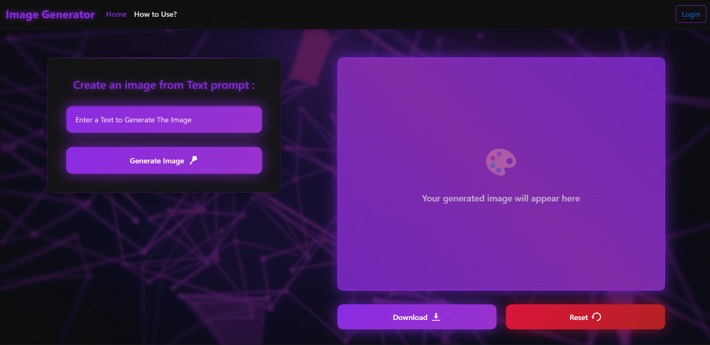
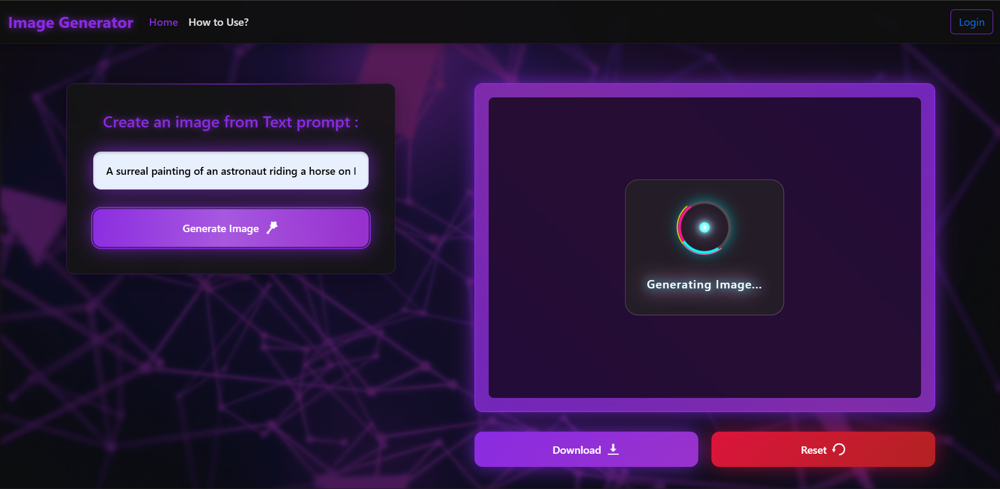
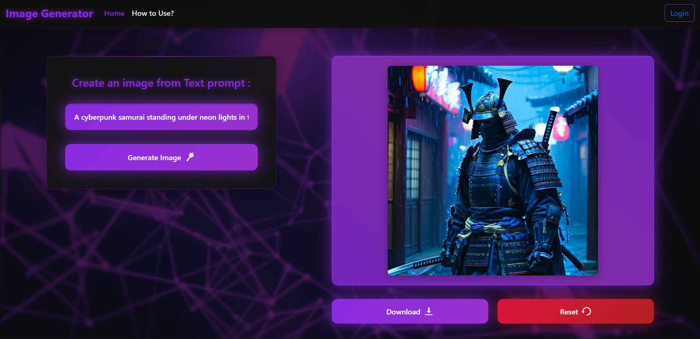

# 🖼️ AI Image Generator

A Flask-based AI Image Generator that creates images from text prompts using Stable Diffusion.  
This project was built as a **seminar project** and demonstrates AI model integration, Flask backend, and a stylish frontend.

---

## 🚀 Features
- Generate unique images from text prompts in real-time
- Modern UI with loader animation and download/reset options
- Flask backend for API integration
- Login & signup pages for user flow
- "How to Use" guide included
- Structured project folders for easy maintenance

---

## 📸 Screenshots

### Home Page


### Generating Image


### Final Output


---

## ⚙️ Tech Stack
- **Backend**: Flask (Python)
- **Frontend**: HTML, CSS, JavaScript
- **AI Model**: Stable Diffusion (via API)
- **Other**: GitHub for version control

---

## 🔑 Setup & Installation
1. Clone the repository:
   ```bash
   git clone https://github.com/your-username/Ai-Image-Generator.git
   cd Ai-Image-Generator

2. Create and activate a virtual environment:
   ```bash
   python -m venv venv
   venv\Scripts\activate   # On Windows
   source venv/bin/activate  # On Mac/Linux
   
3. Install dependencies:
   ```bash
   pip install -r requirements.txt

4. Add your API key:
- Create a .env file in the root folder.
- Add:
  ```bash
   API_KEY=your_api_key_here

5. Run the app:
   ```bash
   python app.py

6. Open browser at:
   ```bash
   http://127.0.0.1:5000

## 📂 Project Structure  
  ```
Ai-Image-Generator/
│── app.py # Flask backend
│── requirements.txt # Python dependencies
│── README.md # Project documentation
│── .gitignore # Ignore sensitive files
│
├── WEB-INF/ # Flask templates & logic
├── Assets/ # Images, styles, and JS
│ ├── Images/ # Icons & placeholders
│ ├── Screenshots/ # Project screenshots
│ └── ...
  ```

---

## 🙌 Credits  

- Stable Diffusion for image generation  
- Open-source tools and libraries   

---

## 📜 License  

This project is licensed under the **MIT License**.  
You are free to use, modify, and share with attribution.  
